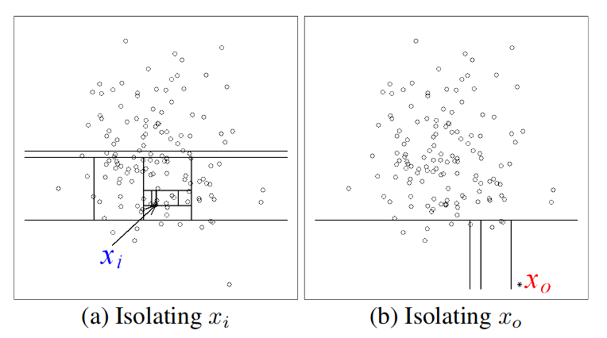

# Credit-Card-Fraud
In this project, we are presented with an anomaly detection problem. In this read me, I will try and explain my thought process in model selection, data analysis and visualization. The notebook itself has some commentary in between steps as well to improve the flow. Note: the classification notebook is supposed to be read after the anomaly detection notebook. Let's jump right in!

## Data Exploration
The first step is to get an understanding of the data we are working with.
The first thing we notice is that our features are anonymized with the exception of Time and Amount. All the other features are named V- to protect the privacy of the credit card holders. This makes it a little harder to understand the "reality" of correlations but doesn't really impact our model's accuracy. All features have data type float and are PCA transformed. PCA transform is a dimension reduction method that transforms a dataset into a set of linearly uncorrelated features. Geometrically, it can be interpreted as finding the principal axes of an n dimensional ellipsoid. PCA transform also has the condition that the data should be scaled (i.e. mean = 0 var = 1). So we only scale time and amount.
We also check how many data points of each class we have. It is around 500 fraud cases to 250000 normal cases.
Another interesting feature is that we are given time and amount. These might have some interesting properties so I plot them on a scatter plot, however, there seems to be no visible correlation/patterns.
Next we plot the continuous histogram over the distributions of the data points (of each class) over each of the features to see the shape of the distribution and any possible correlations. This sets us up for the possibility of using a gaussian analysis model.

I'm curious our dataset can be "clustered". I use a TSNE transform to project our dataset onto a 2-dimensional space. It does a good job of clustering our data. Seems like we can almost draw a line cutting between the normal and positive cases. However, we must be careful as it is very easy to misinterpret the TSNE transform. The key things to remember: Cluster sizes mean nothing, distance between points mean nothing. TSNE is good for shapes and general idea of datasets. After tuning the complexity and the learning rate, it seems like we can conclude there are two distinguishable groups of normal and fraudulent data.

## Metrics and Training/Test Split
For anomaly detection problems, accuracy is a misleading scoring mechanism as we really should be caring about how the model classifies anomalous data. For example, our model could classify the whole data set as non-fraud and still yield an accuracy of 99%. I set up some metrics including the false positive, false negative rate, recall and precision. These are better indicators of how well our model classifies anomalous data. F1 is our general model performance, which is calculated by the harmonic mean of the recall and precision. I split the data set 80/20 using stratified shuffle split, to ensure both sets have the same proportion of outliers. For the classification model notebook, I opted for a 80/10/10 split, so I could use the cross validation set to tune and experiment with different models. 

## Model Considerations (Anomaly detection, Unsupervised)
Now, gaussian analysis is originally a model used when the dataset is unlabelled. It assumes that features follow a normal/gaussian distribution over all/most of its features and if not it is the data scientists job to reshape/drop features that are unimportant or malformed. Gaussian analysis works on the assumption that anomalies lie far away from the mean of each feature. This 'score' is multiplied over all features and we chose an epsilon threshold to decide how lenient we want to be.

However, since our dataset is labelled, it makes our job alot easier as we can explicitly see the distribution of positive and negative classes for each feature. We know which features are key by recognizing a difference in distribution. For example:
V15 is a bad feature to perform analysis on as the anomalous datapoints follow almost an exact distribution as those of normal datapoints. However, V12 is a good feature as the anomalous datapoints are seperate from the normal datapoints and we know if datapoints differentiate from the mean of the normal case, it is more likely to be an anomaly. (Question for future me: How to construct a model if the data is labelled? How can we use that to our advantage for gaussian analysis?).

Gaussian analysis seems a little bit fussy as we have to choose an epsilon and manipulate the data. After a bit of googling, I stumble upon a model called an Isolation forest (iForest). IForests are great when working with higher dimensional and large datasets with irrelevant features. IForests work based on the fact that anomalous datapoints can be seperated with fewer decisions in a decision tree since it has more distinct data characterstics. This yields a shorter tree than a normal datapoint. Geometrically, this can be interpreted as: anomalous data takes fewer splits to isolate than normal data.  IForests are usually run on unlabelled datasets, but I test my luck on how well it can model this dataset. 

I train the model and get a pretty mediocre score. Removing some of the unimportant features would help further differentiate the path length between anomolous and normal data. I run a random forest regressor to get the feature importance and remove unimportant features, leaving about 5 features. This increased the F1 score greatly, but still isn't as good as I hoped.

## Model Considerations (Supervised)
We first try the king of all binary classification problems, logistic regression. Since our dataset is heavily imbalanced, I try undersampling and oversampling to balance the classes. I also use IQR to remove the extreme outliers that might skew our model in an undesirable direction. I run logistic regression with different training sets, different hyperparamters and found two linear models, one optimizing for F1 and the other for Recall (which could potentially be used for a voting classifier). I then try random forests and XGB models. They yield better results. Lastly, I experimented with a voting classifier, to try and combine the strengths of my logistic regression, random forest and XGB. I found it quite difficult to tune the weights, as LR has a very bad pricision and RF/XGB has very bad recall. The voting model's cancel each other out and didn't show much improvement.

## Conclusion/Future Steps/Interpretation
I plotted the models onto a precision/recall graph to select a model. XGB, random forest, and voting classifier seem to perform similarly. I would select XGB however, as it has a lower false negative rate. It's better to have a few false alarms then to let actual fraudulent transactions through. On the test set, the XGB model has F1 of 0.87. 
To improve our models in the future, we could try to collect more data or try different models like gaussian analysis. However, I believe some fradulent data points would be almost impossible to seperate as they can be perfectly disguised as normal transactions.

